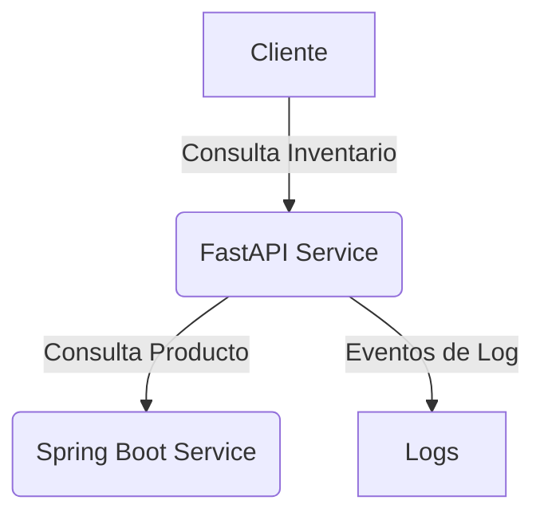

# Microservicios: Productos e Inventario

Este repositorio contiene una solución basada en microservicios para la gestión de productos e inventarios, implementada con:

- `Spring Boot` para el servicio de productos
- `FastAPI` para el servicio de inventarios
- Estándar de comunicación: `JSON:API`
- Contenedores gestionados mediante `Docker Compose`

## Puertos expuestos

| Servicio              | Tecnología              | URL de acceso                  |
|-----------------------|---------------------------|---------------------------------|
| Inventario-Service     | FastAPI + MongoDB         | http://localhost:8000           |
| Producto-App           | Spring Boot + PostgreSQL  | http://localhost:8080           |

(Las bases de datos MongoDB y PostgreSQL están disponibles solo dentro de la red de Docker)

## Tecnologías principales

- **Inventario-Service**: FastAPI, MongoDB
- **Producto-App**: Spring Boot, PostgreSQL
- **Docker Compose** para orquestación
- **API Key Auth** para seguridad de servicios

## Requisitos

- Docker
- Docker Compose

Opcional para desarrollo local:
- Python 3.11+
- Java 17+
- Maven

## Ejecución local

Clona el repositorio y levanta los contenedores:

```bash
docker compose up --build
```

> Tip: Usa el script `make local-test` si deseas correr pruebas locales automáticamente.

## Arquitectura general



- **producto-app**: CRUD de productos, respuestas formateadas en JSON:API.
- **inventario-service**: Manejo de stock, compras y consultas de inventario.

Ambos servicios validan el acceso mediante **API Key**.

## Pruebas

- **Inventario-Service**: `pytest`
- **Producto-App**: `Maven`
- **Pruebas de integración entre servicios** usando `httpx`.

Puedes correr todos los tests automáticamente con:

```bash
make test
```

## Buenas prácticas

- **Estandarización JSON:API** en todos los endpoints.
- **Docker Compose** preparado para extensión futura.
- **API Keys** configurables como variables de entorno.
- **Healthchecks** automáticos en todos los servicios.

## Futuras mejoras sugeridas

- Implementación de mensajería (Kafka, RabbitMQ)
- Uso de Redis como caché intermedio
- Implementar un API Gateway para centralizar autenticación
- Monitoreo de métricas con Prometheus + Grafana

## Contacto

Proyecto desarrollado por:

**Gustavo Adolfo Mojica Perdigón**  
Correo: gmojica@unal.edu.co  
2025

