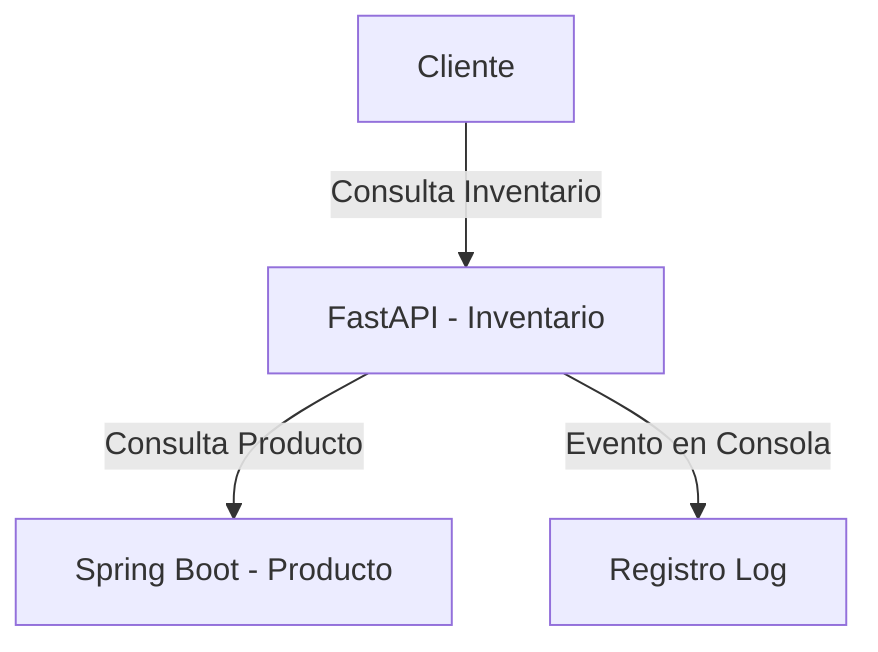

# Microservicios Productos e Inventario

Este proyecto implementa una solución basada en microservicios que gestiona productos e inventarios. Utiliza `Spring Boot` para el servicio de productos y `FastAPI` para el servicio de inventario, ambos comunicándose bajo el estándar JSON:API.


### Puertos expuestos
- `http://localhost:8000` → inventario-service (FastAPI)
- `http://localhost:8081` → producto-app (Spring Boot)
- `mongo:27017` → MongoDB (solo interno)
- `postgres:5432` → PostgreSQL (solo interno)

### Servicios y contenedores
- `inventario-service`: FastAPI + MongoDB
- `producto-app`: Spring Boot + PostgreSQL
- Base de datos NoSQL: MongoDB v6
- Base de datos SQL: PostgreSQL 15-alpine

## Instrucciones de instalación y ejecución

### Requisitos previos
- Docker y Docker Compose instalados.

### Ejecución
```bash
git clone https://github.com/tu_usuario/tu_repositorio.git
cd tu_repositorio
docker compose up --build
```

Ambos servicios estarán disponibles en:
- Producto: `http://producto-app:8080`
- Inventario: `http://localhost:8000`

## Arquitectura

La solución se compone de dos microservicios independientes:

- **producto-app (Java Spring Boot + PostgreSQL)**: CRUD de productos con paginación.
- **inventario-service (FastAPI + MongoDB)**: Consultas y actualizaciones de inventario, que se comunican con el microservicio de productos.

Ambos servicios están protegidos mediante autenticación por API Key.

## Diagrama de interacción



## Decisiones técnicas

- **Spring Boot + PostgreSQL**: óptimo para CRUD robustos y manejo estructurado de datos relacionales.
- **FastAPI + MongoDB**: ideal para manejar datos más flexibles como el historial de movimientos.
- **JSON:API**: permite estandarización, documentación y facilidad de pruebas.
- **API Key Auth**: mecanismo básico pero efectivo para autenticación entre microservicios.
- **Docker Compose**: facilita despliegue y desarrollo con múltiples servicios.

## Guía de implementación para nuevos desarrolladores

1. Cada microservicio tiene su propio `README.md`, `Dockerfile` y `requirements`.
2. Usa API Keys que puedes configurar como variables de entorno en `docker-compose.yml`.
3. Todos los endpoints están documentados con Swagger/OpenAPI en `/swagger-ui.html` (Spring) y `/docs` (FastAPI).
4. Las pruebas se encuentran en `tests/` y pueden ejecutarse con `pytest` o `mvn test`.

## Recomendaciones para escalar

- Migrar eventos de consola a Kafka o RabbitMQ.
- Introducir Redis como caché para productos.
- Implementar un Gateway/API Manager para centralizar seguridad y monitoreo.
- Añadir métricas Prometheus y paneles Grafana.

## Autor

Desarrollado por Gustavo Adolfo Mojica Perdigon  
Correo: gmojica@unal.edu.co  
2025